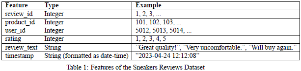

# Online Sneaker Store Classification Tool

## Introduction
In today’s competitive online retail environment, customer reviews are more than just feedback; they are influential pieces of information that can significantly affect a potential buyer’s decision. For an online sneaker store, these reviews are a rich source of insights that, if analyzed effectively, can lead to improved customer satisfaction and refined marketing strategies. However, manually sifting through thousands of reviews to gauge customer sentiment is impractical and time-consuming. It is challenging for store managers to quickly and accurately understand the sentiment behind customer feedback and to act accordingly. The problem this project aims to solve is: How can the online sneaker store automate the process of analysing and understanding the sentiment behind customer reviews, and how can this analysis be seamlessly integrated into the store’s website for real-time insights? To address this problem, this project proposes the development and deployment of a Sentiment Analysis Service. This service will use a pre-trained machine learning model to automatically analyze customer reviews and categorise them into positive, negative, or neutral sentiments. The analysis will be exposed through an API and integrated into the store’s existing e-commerce website. This solution aims to enable the store to respond more effectively to customer feedback, enhance user engagement, and ultimately drive business improvements based on data-driven insights.

## DATA DESCRIPTION
The Sneakers Reviews Dataset is a pre-collected set of customer reviews for various sneaker products sold by an online store. This dataset(Sneakers Reviews Dataset) is provided in CSV (Comma Separated Values) format, making it easy to import into various data analysis tools and programming environments.

## Features

### Backend (Django Rest Framework API)
- **Data Endpoint**: Allows for retrieval and submission of sneakers data records.
- **Prediction Endpoint**: Accepts sneaker characteristics as input and returns a classified sentiment.
- **Scalability**: Built to handle a large number of requests efficiently.
- **Security**: Proper authentication and data validation mechanisms are in place.

### Frontend (Django App)
- **review_id:** This contains the ids of the reviews of the products(sneakers).
- **product_id:** This contains the ids of the products (sneakers).
- **user_id:** This contains the ids of the users which submitted the review.
- **rating:** This contains the ratings of the product by the user who submitted the review.
- **review_text:** This contains the texts the users submitted as a review of the product.
- **timestamp:** This contains the dates of which the reviews were submitted.

### Overall Features
- **Comprehensive Analysis**: Considers a wide range of sneaker characteristics for a holistic evaluation.
- **Accuracy**: Uses a state-of-the-art machine learning model trained on a diverse dataset to ensure reliable predictions.

## Technology Stack
- **Backend**: Django Rest Framework is utilized for creating a robust and scalable API.
- **Frontend**: Django's templating system, combined with modern HTML and CSS, provides a rich user interface.
- **Database**: The default Django database (SQLite) stores the diamond data but can easily be swapped with more scalable options like PostgreSQL for larger deployments.
- **Deployment**: The platform is designed for easy deployment on cloud platforms like AWS.

## Conclusion
The online sneaker store review classification tool is a comprehensive platform designed for sneaker lovers. It bridges the gap between traditional gemology and modern data analytics, offering a reliable method to assess the online store reviews and the sneaker reviews to help the company grow and meet customers' needs.